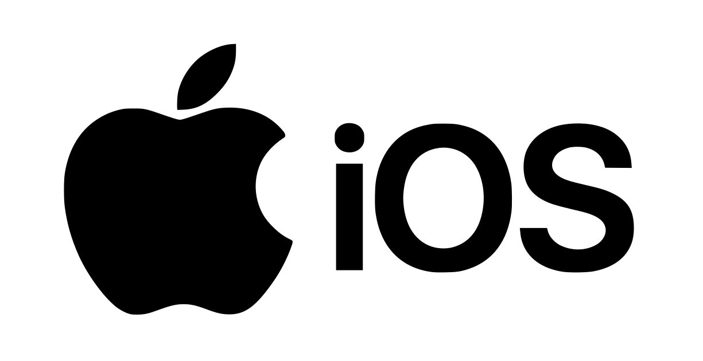
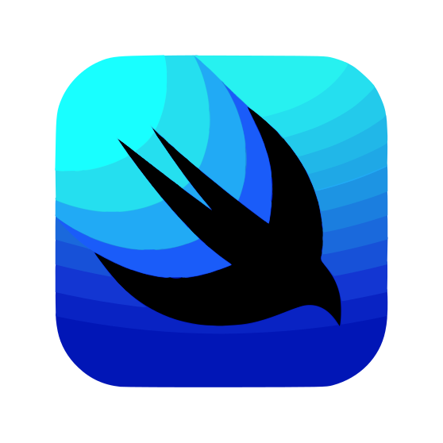
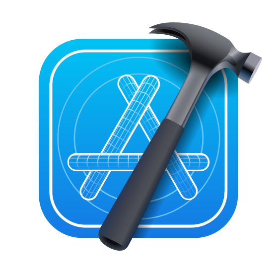
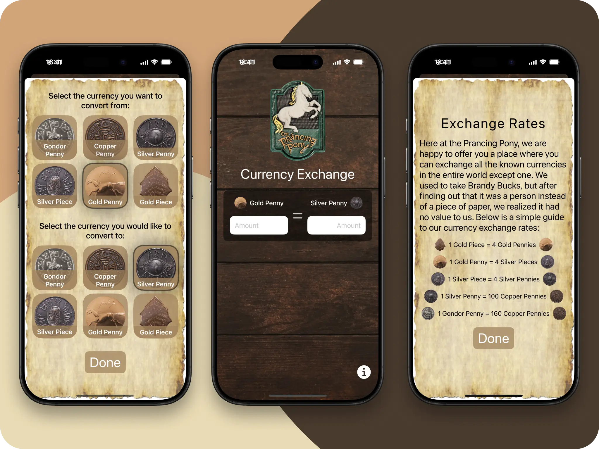

   

# Hi 👋 there!

So glad you've dropped by my coding corner. Here, it's all about ios
coding magic.

Between coding sessions, I'm probably out cycling 🚴‍♂️ or having fun annoying my
kids (they secretly love it 😁).

Dive 👀 into my projects, see what sparks joy, and let's chat 💬 about anything
from tech to the best cycling routes.

Happy exploring!

# Project: Lord Of The Ring - Currency Converter App

[Frontend Mentor](https://www.frontendmentor.io) challenges that help to improve
coding skills by building realistic projects.

### Overview

A simple, user-friendly app designed to convert Lord of the Rings-inspired currencies. Users can enter an amount in the left field and instantly view the converted value in the right field. Choose from six Middle-earth currencies by tapping on an icon in the currency selection screen. The app also includes an information screen displaying current exchange rates for all denominations. Built with Swift, this app provides a fun, interactive experience for fans and fantasy lovers alike.

Your users should be able to:

- Enter an amount in one field to convert it to another currency.
- Select from six currencies by tapping on an icon.
- View exchange rates for all currencies on the info screen.
- Save preferred currencies for future use.
- Switch between left and right currency fields for conversions.

### Tech Stack:

- Swift;
- SwiftUI;
- TipKit
- Xcode
- Git
- GitHub

## Author

- LinkedIn - [Serhii Orlenko](https://www.linkedin.com/in/grifano/)
